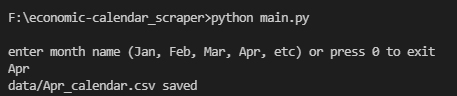
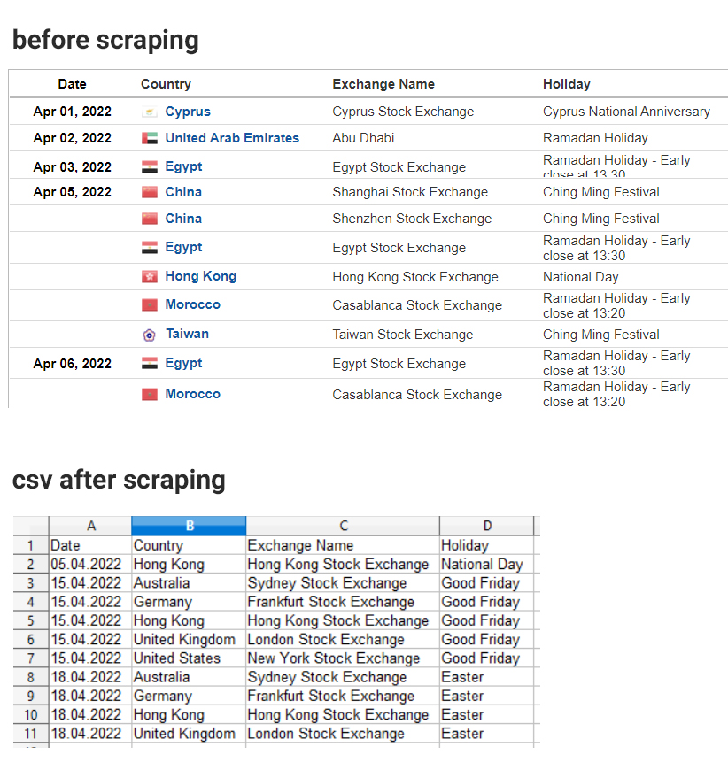

# economic-calendar_scraper
A scraper for https://www.investing.com/holiday-calendar/ using pandas and BeautifulSoup

    

The scraper saves a csv file with holidays for a particular month for all major exchanges (Sydney, Tokyo, Hong Kong, New York, Frankfurt and London)

    

